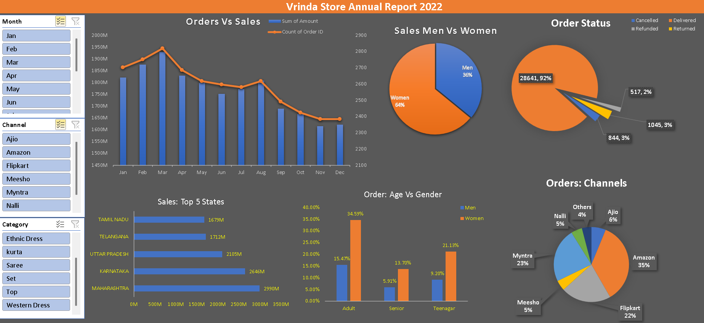

# Vrinda Store Sales Dashboard 📊

## Project Overview
This project is an interactive Excel dashboard created to analyze Vrinda Store sales data for the year 2022.

The dashboard helps to understand sales trends, customer behavior, and business performance.

---

## Objectives

- Analyze monthly sales and order trends
- Compare sales between men and women
- Track order status
- Identify top-performing states
- Analyze sales channels performance
- Understand customer age group behavior

---

## Tools Used

- Microsoft Excel
- Pivot Tables
- Pivot Charts
- Data Cleaning
- Data Visualization
- Dashboard Design

---

## Dashboard Features

- Orders vs Sales Analysis (Monthly)
- Sales Distribution by Gender
- Order Status Breakdown
- Top 5 States by Sales
- Sales by Channels (Amazon, Flipkart, Myntra)
- Age Group vs Gender Analysis
- Interactive Filters using Slicers

---

## Insights

- Women customers contributed more sales than men
- Most orders were successfully delivered
- Maharashtra recorded the highest sales
- Amazon generated the highest number of orders
- Adult age group placed the majority of orders

---

## Project Screenshot

# Vrinda-Store-Sales-Dashboard
Excel Sales Dashboard Project using Vrinda Store Data
